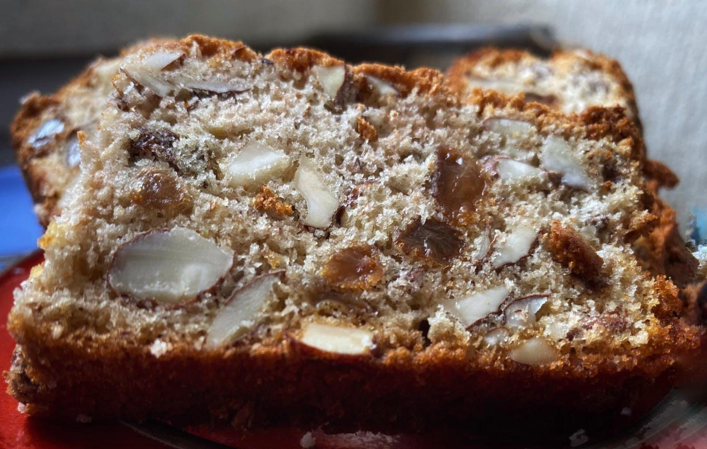

# Biškotini none Emice

U doba none Emice, frižideri su još bili novost, a namirnice poput čokolade skupe i teško dostupne. Nona je zato radila kolače koji su mogli trajat dulje. Ako bi biškotina ostalo, nona bi pojela dok bi pila kavu, ali samo po jednu fetu na dan jer je nona uvik pazila na liniju.

## Sastojci

* 4 jaja
* 20 dkg cukra \(šećera\)
* 20 dkg Glatkog brašna
* 20 dkg Suvica \(grožđica\)
* 25 dkg bajama
* 1 prasak za pecivo
* 3 žlice ruma

## Priprema

1. Bajame nasjeckati nožem \(ne mikserom\).
2. Žumanca tući s cukrom dok ne posvitle.
3. Postepeno dodavati brašno, suvice, bajame, prašak, rum i na kraju snig od 4 bilanjka.
4. Uliti u roštjeru i peći 45 minuta na 180 stupnjeva.
5. Kad se oladi narizati na tanke biškotine.

## Posluživanje

Poslužite kao desert ili uz jutarnju kavu.

