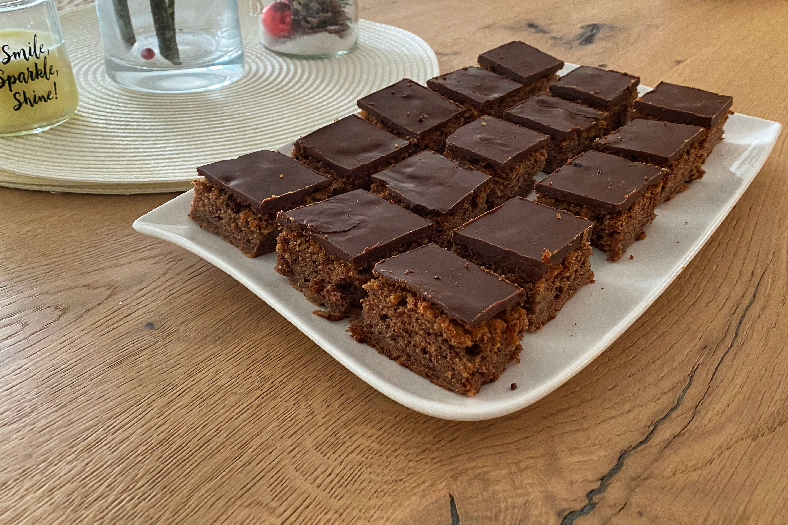

# Kolač od rogača none Emice

## Sastojci

### Biskvit

* 4 jaja
* 1 šalica \(1,75 dcl\) brašna
* 1 šalica cukra \(šećera\)
* 0,5 šalice mlika
* 0,5 šalice ulja
* 4 velike ribane jabuke
* 10 dkg mlivenog rogača
* 1 prašak za pecivo
* 1 vanilija
* 1 žlica cimeta

### Glazura

* 10 dkg čokolade
* 10 ml vrhnja za kuhanje

## Priprema

### Biskvit

1. Jabuke naribati, posuti vanilijon i cimetom pa neka malo odstoji.
2. Dobro izmišati žumance, cukar i rogač. Naizmjenice dodavati brašno pomišano s praškon za pecivo te mliko i ulje dok ne dobiješ glatku smjesu. 
3. Umišati ribane jabuke, te snig od bilanjca \(ne miksati, nego lagano pomišati\).
4. Uliti u roštjeru i peći na 180 stupnjeva 35-40 minuta.

### Glazura

1. Vrhnje zakuvat i dobro zamišat s čokoladon.
2. Kad se bisvkit ohladi preliti s glazuron.

## Posluživanje

Poslužiti kad je ladno.

