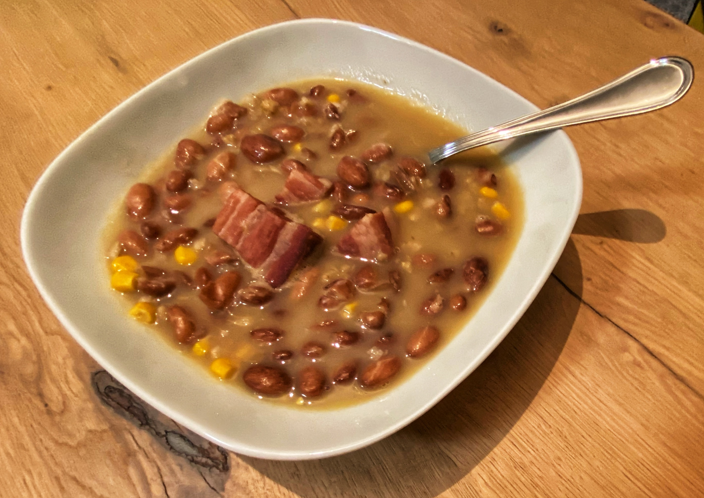

# Maneštra none Emice

> Nona Emica je uvik imala jednostavna pravila. Utorkon se kuvala juva-lešo i onda se ta juva jela svaki dan do subote. Suboton se radila "falša" juva tj. juva od povrća, a nedilja je bila rezervirana za maneštru \(pašta fažol\). Iako je nona \(i sve none prije nje\) bila iz Dalmacije, nediljon se radila istrijanska verzija da se udovoji i toj strani familije, ali uz malu prilagodbu recepta na nonin način. Nemoj da neko pita, ali ponediljkon se jela koja god juva je ostala od prethodnih dana!

## Sastojci

* 0,5 kg fažola \(šareni grah\)
* 10 dkg orza \(ječma\)
* 1 manja glavica luka \(češnjaka\)
* 2 klasa mlade trukinje \(kukuruza\)
* 3 srednja krumpira
* 20 dkg pancete \(slanine\) ili drugog suhog mesa \(kost od pršuta, rebarca\)
* 10 dkg krupne tjestenine

## Priprema

1. Fažol \(grah\) pomočiti dvanest uri prije
2. Otić leć
3. Oprati fažol, staviti u lonac, pokriti vodon, prokuvati i tu vodu baciti
4. Nakon toga u lonac dodati sve ostale sastojke i uliti 4-5 litara vode.
5. Kuhati na laganoj vatri uru do uru i po
6. Kad je fažol \(grah\) kuvan, zgnječiti krumpire \(tako se dobije gustina juhe\)
7. Po želji se u lonac može dodati pet, šest deka krupne tjestenine i prokuhati još desetak minuta.

## Posluživanje

Posoliti po želji. Ne pretjerivati jer je meso slano, a puno soli nije ni dobro za visoki tlak!

Kod posluživanja klasovi \(klipovi\) trukinje \(kukuruza\) mogu ostati cijeli ili im se skidaju zrna koja ostaju u maneštri.

